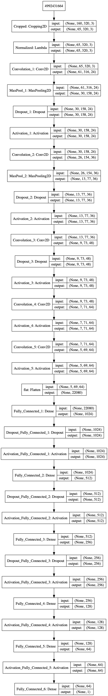

# **Behavioral Cloning** 

---

**Behavioral Cloning Project**

The goals/steps of this project are the following:
* Use the simulator to collect data of good driving behavior
* Build, a convolution neural network in Keras that predicts steering angles from images
* Train and validate the model with a training and validation set
* Test that the model successfully drives around track one without leaving the road
* Summarize the results with a written report

---
## Development

### Development Files

| File | Description |
| ------ | ------ |
| trainer.py | Model Trainer Implementation |
| drive.py | Run Trained Model on Simulator | 
| video.json | Convert Simulator Output into MP4 Video | 
| autoRun.mp4 | Model Result Video |
| trainedModel/  | Trained Model (zipped and split to fit on Github) |

## Data Augmentation

In order to increase the dataset, all data generated by the simulator was augmented by flipping the images horizontally and inverting the steering value:

This process not only increases the dataset but also ensures that it includes the same number of right and left turns.

## Model Architecture

Before defining a starter model, two preprocess layers were added to the architecture. These two layers are responsible for removing the parts of the image that are not relevant for the training process and normalizing the data for better performance.
After that, a model similar to the one used by NVIDIA [(Link)](https://devblogs.nvidia.com/deep-learning-self-driving-cars/)  was implemented and tested. However, instead of a single image input, this model included three parallel identical convolution structures, one for each camera. The convolution outputs were then merged and inputted to the fully connected part of the model. Later on, it was discovered that the autonomous version of the simulator only returns the central camera image, making it impossible to use this model.
A similar model, but with only one input, was then implemented and tested. Since the used strides were always of the size 1x1 and no pooling was added, the number of outputs from the convolution was huge, making the training process extremely slow. In order to fix that, two MaxPooling layers were added to the first two convolution layers. Next, it was concluded that an extra fully connected layer would be helpful and so it was added to the structure. Finally, to reduce overfitting, some dropout layers were added to the final model.

The final model can be seen in the image below:

The Parameters can be seen  below:

#### Convolution Layers
| Layer                  | Filters |  Kernel | 
|----------------|------|-------------|
| Convolution_1 | 24 | 5x5 |
| Convolution_2 | 36 | 5x5 |
| Convolution_3 | 48 | 5x5 |
| Convolution_4 | 64 | 3x3 |
| Convolution_5 | 64 | 3x3 |

#### MaxPooling Layers
| Layer                  | Size  | 
|----------------|------|
| MaxPool_1 | 2x2 |
| MaxPool_2 | 2x2 |

#### Dropout Layers
| Layer                  | Dropout Rate  | 
|----------------|------|
| Dropout_1 | 0.2 |
| Dropout_2 | 0.3 |
| Dropout_3 | 0.2 |
| Dropout_Fully_Connected_1 | 0.3 |
| Dropout_Fully_Connected_2 | 0.2 |
| Dropout_Fully_Connected_3 | 0.1 |

#### Activation Layers
| Layer                  | Activation Function  | 
|----------------|------|
| Activation_1 | Relu |
| Activation_2 | Relu |
| Activation_3 | Relu |
| Activation_4 | Relu |
| Activation_5 | Relu |
| Activation_Fully_Connected_1 | Relu |
| Activation_Fully_Connected_2 | Relu |
| Activation_Fully_Connected_3 | Relu |
| Activation_Fully_Connected_4 | Relu |
| Activation_Fully_Connected_5 | Relu |

#### Dense Layers
| Layer                  | Outputs  | 
|----------------|------|
| Fully_Connected_1 | 1024 |
| Fully_Connected_2 | 512 |
| Fully_Connected_3 | 256 |
| Fully_Connected_4 | 128 |
| Fully_Connected_5 | 64 |
| Fully_Connected_6 | 1 |

## Training Process

In order to compile the model and proceed to the training process, an Adam optimizer and a Mean Square Error loss were selected. Next, the dataset was split into training and validation datasets, corresponding to 80% and 20%, respectively, of the original dataset. After some tests, it was concluded that better results were obtained by not using a batching approach. Also, ten epochs appeared to be sufficient for obtaining good results.
Finally, a callback was defined for saving only the best model found. For convenience, the provided dataset was used for training the model.
